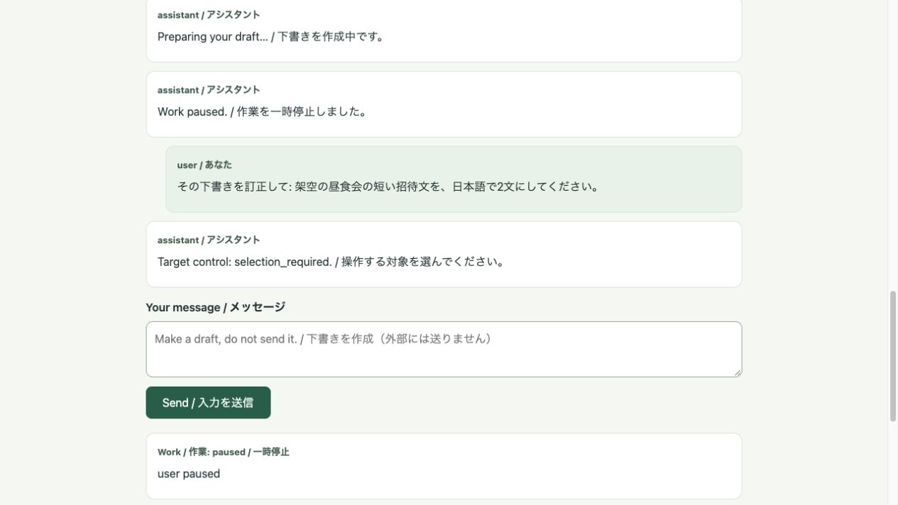
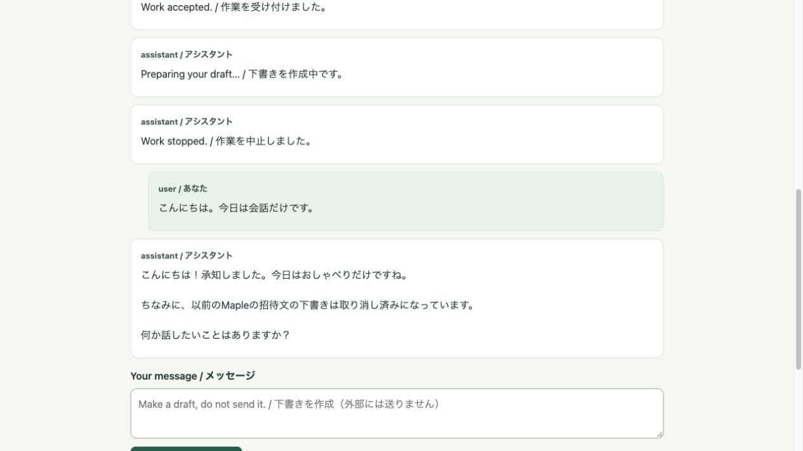

# HR-STABLE1-001 — Stable1の実機能の有用性評価

対象バージョン：605791e723df31df454ad082423d3b5a7205c0e7。旧Stable0評価は流用しません。以下はコントローラーが合成入力を実画面で操作し、公式Claudeで生成した実出力です。本人入力とは扱っていません。

判断が必要な理由：自然な依頼、対象の訂正・中止、質問量、下書きの実用性が本人の使い方に合うかは、自動テストでは判定できません。推奨は、新候補の出力と操作結果を見て、合う点と合わない点を評価することです。

解除条件：このバージョンについて本人から直接の評価を受け取ること。問題点があれば記録し、修正・再検証後に本人が判断します。依存作業はN1-07とN1-08の最終監査・Stable1リリースです。P001全体計画採用・Projects認可とは別の判断です。

## 評価する4観点（実行前に凍結）

1. 自然な依頼として理解されているか。
2. 意図した作業だけが訂正・中止されているか。
3. 不要な日常的質問が増えていないか。
4. ローカル下書きが役立つ内容か。

## 新候補の全6出力

以下をすべて読み、評価材料として提示してください。抜粋した好結果だけでは判断しません。

| ケース | 依頼 | 全文 |
| --- | --- | --- |
| A1 | 宛名・日付・開始時刻を指定しない短い昼食会招待文 | [実出力](A1/draft.txt) |
| A2 | A1と同じ依頼、独立したDB | [実出力](A2/draft.txt) |
| B1 | 相手や貢献を指定しない2文の感謝 | [実出力](B1/draft.txt) |
| B2 | B1と同じ依頼、独立したDB | [実出力](B2/draft.txt) |
| C1 | CedarとMika、設計の議論を整理してくれたという提供済み事実に基づく2文の感謝 | [実出力](C1/draft.txt) |
| C2 | C1と同じ依頼、独立したDB | [実出力](C2/draft.txt) |

## 実画面での作業操作

CedarとBirchの2作業を一時停止。曖昧な「その下書きを訂正して」では勝手に選ばず、2対象のボタンを表示しました。Cedarを選ぶとCedarだけ訂正、Birchは一時停止のままです。固定criteriaと元の訂正入力の根拠を保持しています。



訂正後のCedarは2文の昼食会招待文です。全文はFLOW1の対応するartifactファイルとstate.jsonを参照してください。

「Birchの下書きを止めて」ではBirchだけを中止しました。Mapleの実行中中止は最初の1件で完成が先に起きたためVOIDのまま保存。事前に決めた1度だけの予備ケースでは実行中に中止し、後着結果をstale artifactとして拒否、下書き・receiptはゼロでした。



中止後の普通の会話にも日本語で応答し、新たなGoalは作っていません。実際の全文はFLOW2_VOID_ONLY/state.jsonの最後のassistant応答です。

## 修正前の失敗も保持

[最初の全5出力・判定](../stable1-20261007/README.md)。C1で「話し合いをスムーズに進めることができました」という未提供の成果を生成したためFAILにして停止しました。Opus・SWEレビューを経て、その効果を推測で加えない指示だけを修正しました。新候補の6出力は旧PASSの流用でなく、独立した再検証です。2サンプルずつの有限確認なので、今後の捏造がなくなる保証とは言いません。

実呼出しは最初6回＋修正候補14回＝計20回。各候補の固定上限32は上限で、呼出し目標ではありません。追加課金は無効、認証・公開・外部送信・DB修復なし。検証ホストは正常停止済みで、評価中の追加モデル呼出しはありません。旧58500画面はStable0であり、このStable1の証拠画面と混同しないでください。

本人からの回答は、この4観点で合っているか、または具体的に変えたい箇所です。開発継続の指示だけでは評価PASSにしません。期限や入力数のノルマはありません。

## Complete new-candidate returned texts

### A1

```text
件名：昼食会のご案内

〇〇様

このたび、ささやかな昼食会を開くことになりました。
ご多用中とは存じますが、ぜひご参加いただけましたら幸いです。

日時：〇月〇日（〇）〇時〜
場所：〇〇

ご都合をお知らせいただけますと助かります。
どうぞよろしくお願いいたします。

〇〇
```

### A2

```text
〇〇様

いつもお世話になっております。
このたび、ささやかな昼食会を開くことになりました。
日時は〇月〇日（〇）〇時〇分からを予定しております。
お忙しいところ恐縮ですが、ご都合がよろしければぜひご参加ください。
お会いできるのを楽しみにしております。

〇〇より
```

### B1

```text
このたびは温かいご支援をいただき、心より感謝申し上げます。今後ともどうぞよろしくお願いいたします。
```

### B2

```text
このたびは温かいお心遣いをいただき、心より感謝申し上げます。重ねて厚く御礼申し上げます。
```

### C1

```text
Mikaさん、Cedarプロジェクトでのご協力に心より感謝申し上げます。特に、設計に関する議論を整理してくださったことに、深くお礼申し上げます。
```

### C2

```text
Mikaさん、Cedarプロジェクトでのこれまでのご協力に心から感謝しています。特に、設計に関する議論を整理してくださったことに、改めてお礼申し上げます。
```

### Selected corrected Cedar

```text
ささやかな昼食会を開くことになりましたので、ぜひご参加いただければ幸いです。皆さまと楽しいひとときを過ごせることを心より楽しみにしております。
```

### Conversation after actual cancellation

```text
こんにちは！承知しました。今日はおしゃべりだけですね。

ちなみに、以前のMapleの招待文の下書きは取り消し済みになっています。

何か話したいことはありますか？
```
