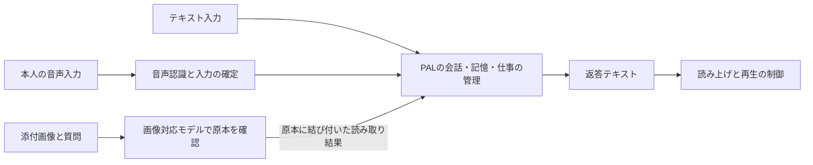

# PALの画像・音声・動画対応：公開実装の調査と設計候補

調査日：2026-10-08 JST。状態：**調査済み・設計候補。製品への採用・実装・実機評価は未実施**。

対象のPALは `/private/tmp/personal-agent-lab-stable0-20261006`、調査開始時 `40a59c35e56bf23c3c21316c4091177eab95bdd7`。この資料は設計チャットの成果物であり、開発側の `DECISIONS.md` や `STATE.md` を置き換えない。現行Stable-1の完成条件・優先順位は変更しない。

## 今回の結論

PALの会話・記憶・仕事の管理を維持し、画像・音声を受け渡す部分を交換できる構成が適している。音声モデルを一つにするか分けるかは、その構成の中で選べる。まずは「音声認識→既存の推論→読み上げ」を比較の基準にし、自然な同時会話が必要な場合は「音声専用の会話担当→PALの推論・仕事担当」も有力候補にする。統合モデルへの全面置換を決めるだけのPAL上の実測は、まだない。

画像は原本を保持し、質問と一緒に画像対応モデルへ渡す。OCR、説明文、タグは、検索や文脈選択の補助として原本に結び付ける。この構成なら、初回の説明に含まれなかった細部を後から画像で確認できる。

**Qwen3.8-27Bは公式モデルカード上、画像・動画入力に対応する。** テキスト専用なのは現在のPAL接続である。したがって、同モデルに画像も任せる案から検証できる。ただし、実際の実行エンジン・量子化版・接続口が画像を正しく渡せるか、PALの目的を満たすかは別途検証する。「別の画像モデルが不要」と確認したわけではない。公式カードは音声入出力を能力として掲げていない。[公式モデルカード](https://huggingface.co/Qwen/Qwen3.8-27B)

次の図は構成候補であり、現在のPALで動いている機能図ではない。

画像対応モデルは推論担当と同じモデルでもよい。図の箱の数はモデル数を意味しない。音声部分は将来Realtime方式へ交換できるようにするが、最初から両方式を実装する必要はない。

## 本人指示と今回の範囲

2026-10-08、本設計チャット `01a11837-e1e3-71f0-8ff8-bbaf8dc14527` で、本人は「今の開発を継続しながら、画像の理解、音声入力、音声での返答（音声出力）を将来要件として明示する」と指示した。まず類似サービスと公開コード・設計を調査し、設計が固まった段階で開発へ渡す。

| ID | 今回明示する内容 | 位置付け |
|---|---|---|
| MM-R1 | 本人が渡した画像について、その内容を理解し、会話や依頼で使える | 本人が指定した将来要件 |
| MM-R2 | 日本語の音声で会話・依頼・訂正を入力できる | 本人が指定した将来要件 |
| MM-R3 | PALの返答を音声で聞ける | 本人が指定した将来要件 |
| MM-C1 | 動画の映像・音声・時間関係を扱う | 調査・拡張候補。実装範囲と完成条件は未確定 |

常時録音、カメラ監視、写真ライブラリの自動取込、話者の本人認証、声の複製、外部送信、新しいAPI契約・追加費用は、上記要件から自動的に追加しない。音声の本人確認と、音声を内容として理解することは別機能である。

## 公開実装から分かったこと

| 対象 | 確認できた方式 | PALへの示唆と限界 |
|---|---|---|
| Qwen-Live-Harness | 音声・映像の会話担当、調整役、バックグラウンドの作業担当を分離。公開コードに音声イベント・中断処理・会話記憶がある | PALの会話継続と仕事の分離に近い。現行の利用経路はDashScope APIを必要とし、PALの既存契約で使える証拠にはならない |
| Open WebUI | 音声認識と読み上げを別エンジンに接続。会話中のカメラ画像は発話ごとに静止画として添付 | 音声の段階導入が参考になる。この「ビデオ通話」は動画全体の時間的理解を実証するものではない |
| LiveKit Agents / Pipecat | 分離型とRealtime型を扱う。入力・文脈・推論・出力、発話終了・割込み・再生状態を管理 | モデル選定だけでは埋まらない会話制御が分かる。PALへフレームワーク全体を導入する判断はしていない |
| Qwen-MM-Plugins | 画像そのものを返す読取、解像度と枚数を制限した時刻付き動画フレーム。動画記憶から元クリップへ戻る処理 | タグ化だけに依存せず、原本の必要部分を再確認できる。長時間動画の階層記憶は初期PALには大きすぎる可能性がある |
| Immich | 原本の識別情報と、CLIP検索用ベクトル、OCRの文字・領域を分離 | 「探すための索引」と「確認する原本」を分ける参考。写真管理の設計であり、会話や仕事の完遂を保証するものではない |
| LibreChat | 添付を種類・接続先の能力に応じ、直接渡す方式とOCR/STTで文章へ変換する方式に振り分ける | 画像対応モデルへ直接渡す経路と、文章抽出を使う経路を明示できる。今回の確認は公式資料まで |

一次資料：[Qwen-Live-Harness](https://github.com/QwenLM/Qwen-Live-Harness)、[Open WebUI Voice Mode](https://docs.openwebui.com/features/chat-conversations/chat-features/voice-mode/)、[LiveKitの方式比較](https://docs.livekit.io/agents/models/pipelines/)、[PipecatのSTT処理](https://github.com/pipecat-ai/docs/blob/main/pipecat/learn/speech-to-text.mdx)、[Qwen-MM-Plugins](https://github.com/QwenLM/Qwen-MM-Plugins)、[Immich検索](https://docs.immich.app/features/searching/)、[LibreChat添付処理](https://www.librechat.ai/docs/features/upload_as_text)。対象コードと版は末尾に記載。

商用サービスの参考では、[OpenAIの公式ガイド](https://developers.openai.com/api/docs/guides/voice-agents)が、独立したバックエンドへ委任する音声窓口、一つのRealtimeモデル、STT→LLM→TTSの三方式を区別している。[Gemini Live](https://ai.google.dev/gemini-api/docs/models/gemini-3.8-live)は画像・音声・動画を入力するRealtime経路を公開している。いずれも公開API仕様の確認であり、ChatGPTやGemini製品内部の非公開実装を確認したわけではない。日本語品質・実費・PALへの適合は未検証。

## 音声の三つの選択肢

| 方式 | 向いている条件 | PALで確認すべき点 |
|---|---|---|
| A：音声認識→推論→読み上げ | 既存の推論・仕事の仕組みを使い、聞き取りと返答を文章でも確認したい | 段階ごとの待ち時間、固有名詞・日付の誤認識、声の調子が文章化で失われる影響 |
| B：Realtime音声窓口→PALの仕事担当 | 作業中も会話を続けたい、相づち・割込み・応答の自然さを重視する | 音声窓口とPALの二重記憶、誤った完了報告、作業の重複委任、追加モデルの費用 |
| C：Omniモデルに理解・推論・発話を集約 | 音声や映像の細かな意味を同時に扱い、モデル数を減らしたい | PALの推論能力、検証可能な入出力、再開・訂正・権限制御を満たせるか |

Aを比較の基準にする理由は、PALの既存テキスト処理へ接続する箇所が明確だからである。Aが会話品質でも最良と判断したわけではない。話し方や環境音の意味が必要な用途では、B/Cの直接音声入力も評価する。

日本語対応を公式に掲げる部品候補には [Qwen3-ASR](https://github.com/QwenLM/Qwen3-ASR) と [Qwen3-TTS](https://github.com/QwenLM/Qwen3-TTS) がある。どちらも0.6B/1.7B系が公開されているが、サイズやメーカーの計測値だけで、このMacでの実用速度・精度・同時動作を断定しない。モデルのインストールも行っていない。

最初の試作候補は、本人が開始・終了する短い録音と読み上げである。発話途中の認識文は表示だけに使い、確定した一つの入力から一度だけ作業を受け付ける。毎回の確認ボタンを増やすことは要件にしない。意味が曖昧で結果を変える場合に、必要な点だけ聞き返す。

文字起こしが確定しても、正しく聞き取れた保証にはならない。依頼を受け付けた画面には、音声から読み取った日付・相手・数量などの重要な条件を表示し、訂正できるようにする。既存の外部操作・不可逆操作の承認境界は維持する。聞き取り誤り対策を理由に、通常の会話すべてへ確認を要求しない。

読み上げを遮る操作と、裏で動く仕事の中止は別に扱う。「黙って」は再生停止、「その下書きを中止して」は対象を特定したPALの中止処理へ渡す。生成した音声と実際に再生した音声を区別し、再生済み範囲が分からなければ不明と記録する。仕事の完了は、音声の再生完了から推定しない。[OpenAIの割込み設計](https://developers.openai.com/api/docs/guides/live-prompting)

## 画像を文章の記憶とつなぐ

例として、予定が書かれた紙の写真を渡し「この内容で案内を作って」と依頼する。画像対応モデルが写真を読み、日付や会場の候補を出す。PALはどの写真から得た内容かを保持する。読めない文字を埋めず、依頼に不可欠なら該当箇所だけ確認する。後から「右下の注意書きも反映して」と言われたら、元画像のその部分を再確認できる。

このため、次の三つを分ける。

1. **原本**：本人が渡した画像・音声・動画。識別子、ハッシュ、種類、必要なサイズ・時間情報、参照可否を持つ。
2. **読み取り結果**：OCR、文字起こし、説明、タグ。原本と位置・時間、生成したモデルや版に結び付け、誤り得る解釈として扱う。
3. **PALが受け付けた内容**：依頼・訂正・記憶・作業の正本。モデルの読み取り結果だけで、無断の操作や「完了」を成立させない。

これは論理的な区別であり、新しいDB製品や複雑なメディア管理基盤の導入を意味しない。具体的なDB変更・ファイル保存の原子性・アダプター契約は実装設計時に確定する。最初は対象の添付と小さな文章索引から始め、画像群の検索が実際に必要になったらベクトル検索を評価する。

タグだけでは位置関係、細かな文字、後から尋ねられた特徴を失う。逆に、毎回すべての原本をモデルへ送る必要もない。索引で候補を絞り、必要な原本・領域だけを読む設計候補とする。

## 動画の扱い

動画には画面と音声に加え、時間関係がある。設計候補は、明示した短い区間を対象に、時刻付きの画像と音声・文字起こしを結び付ける方式である。Qwen3.8の動画入力が、そのまま動画中の音声理解を意味するわけではない。別の音声認識を使う場合は、切り出し位置や音声処理後の時間軸を元動画の時刻へ戻す処理が必要になる。その同期方式と精度は未検証である。質問に応じて該当区間を詳しく再確認する。

画像を間引く方式では、短い出来事を見落とし得る。処理した時間範囲・フレーム間隔・解像度を証拠へ残し、確認していない場面を断定しない。固定の抽出間隔を全用途へ流用しない。音付き動画を直接扱うOmni経路も比較対象にするが、「音声と映像を同じ時刻で扱えたか」を実際に測る。

長時間動画の全面索引、常時カメラ・画面共有、監視・通知は別の拡張候補である。静止画一枚の受付を「動画対応完了」と扱わない。

## PALで維持する境界

- 添付画像内の文字や、添付動画・録音中の発話は入力資料として扱い、内部に書かれた命令で権限を増やさない。一方、本人が明示した音声入力の経路は、文字起こしを本人の依頼候補として既存の受付・対象特定・権限制御へ渡す。添付の内容と本人の操作指示を混同しない。
- モデルに渡す原本・範囲・送信先はホストが選ぶ。現在のテキスト用秘密情報除去で、画像内の文字や音声まで保護できるとは見なさない。
- EXIFの位置情報などは既定でモデルへの送信・索引対象に含めず、用途に必要な項目だけを選ぶ。保存した原本を勝手に書き換えることとは分ける。
- 「忘れて」は原本のAI参照だけでなく、OCR・文字起こし・説明・検索索引、そこから作った応答・会話要約、再利用キャッシュにも反映する。原本への依存関係を保持し、処理中に参照停止された入力から返った結果も適用しない。履歴や成果物は本人が閲覧できるまま、後続のAI文脈・検索・有効な現在結果から除外する。これは既存の参照停止方針の拡張候補であり、物理削除の保証ではない。
- 音声は作業結果の保存・検証後に、その確定した状態を伝える。音声窓口が勝手に「終わりました」と報告したり、別の永続記憶を更新したりしない。
- ファイル名だけで形式を信用せず、実形式・サイズ・解像度・長さを受付時に制限する。未対応形式や予算超過を、対応済みの表示に置き換えない。
- デコードやモデル処理は明示した能力の範囲へ隔離する。モデルに一般ファイル読取・shell権限を与える近道は採らない。

## 設計を確定するための小さい実測

| 対象 | 実測すること | 完成を誤認しない条件 |
|---|---|---|
| 音声入力 | 実際の日本語、固有名詞、数字・日付、言い直し、背景雑音、無音 | 最終入力と作業対象が正しい。無音・途中結果・重複で作業が生まれない |
| 音声出力 | 読み方、応答開始までの時間、割込み、再接続、実際に再生した範囲 | 画面の確定結果と矛盾しない。中止後に古い音声が戻らない |
| 画像 | 文書、位置関係、小さい文字、読めない箇所、OCRとの矛盾 | 原本・必要領域へ戻れる。見えていない内容を作らない |
| 参照停止 | 画像・音声を使った後に忘れる／処理中に参照停止する | すべての派生物と処理中結果に同じ禁止が働く |
| 動画候補 | 短い出来事、音と映像の時間対応、抽出されなかった区間 | 原本の時刻へ戻れる。未観測を区別する |
| 共通 | 訂正、中止、再送、再起動、二つの作業がある状態 | 既存の対象特定・重複防止・古い結果の拒否を維持する |
| 実行資源 | 推論・画像・音声認識・読み上げのメモリ量と同時／順次実行 | 音声が推論を圧迫して会話や作業を止めない。追加クラウド利用を暗黙の解決策にしない |

対象端末・候補モデル・実行経路を確認し、代表入力と合格条件を実行前に固定する。平均速度の宣伝値やmock合格を、PALでの実用性の証明へ転用しない。方式の比較には、入力終了から最初の音が聞こえるまでの時間と、本人の会話のしやすさを含める。現時点で具体的な性能値は未測定である。

対応可否はモデル名だけで登録しない。モデル・実行エンジン・量子化版・接続方式の組ごとに、実際に受理された入力の種類、解像度、フレーム数などの検証条件と結果を残す。音声の実用性を確かめる順番は、短い本人入力→画面での認識確認→返答の読み上げ→訂正・中断とする。これは将来の評価手順であり、現在のStable-1の追加完了条件ではない。

## 公開コードの確認範囲

公開リポジトリ5件、計24ファイルを取得して関連箇所を確認した。取得ファイルのSHA-256と固定URLは [source-receipts.json](source-receipts.json) にある。取得コードの実行、依存導入、モデルダウンロードは行っていない。以下の版は調査時点のスナップショットである。設計に関係する箇所の調査であり、各製品全体の品質・安全性監査ではない。

| Repository / 固定版 | 特に読んだ場所 | ライセンス表示 |
|---|---|---|
| Qwen-Live-Harness `b6ce544` | [会話・委任](https://github.com/QwenLM/Qwen-Live-Harness/blob/b6ce544ebbcd7417e37e0314ec946466c49c615c/packages/qwen-live-harness/src/orchestrator/live-session.ts)、[音声イベント](https://github.com/QwenLM/Qwen-Live-Harness/blob/b6ce544ebbcd7417e37e0314ec946466c49c615c/packages/qwen-live-harness/src/realtime/realtime-session.ts)、[記憶形式](https://github.com/QwenLM/Qwen-Live-Harness/blob/b6ce544ebbcd7417e37e0314ec946466c49c615c/packages/qwen-live-harness/src/memory/schema.ts) | Apache-2.0 |
| Qwen-MM-Plugins `e469e92` | [画像原本](https://github.com/QwenLM/Qwen-MM-Plugins/blob/e469e92dcd662ab0c4adc798fc50a094c832bfc0/src/capabilities/core/qwen_mm_plugins_core/readers/image.py)、[動画抽出](https://github.com/QwenLM/Qwen-MM-Plugins/blob/e469e92dcd662ab0c4adc798fc50a094c832bfc0/src/capabilities/core/qwen_mm_plugins_core/readers/video.py)、[元クリップへの参照](https://github.com/QwenLM/Qwen-MM-Plugins/blob/e469e92dcd662ab0c4adc798fc50a094c832bfc0/src/capabilities/omni-memory/qwen_mm_plugins_omni_memory/tools/get_moment.py) | Apache-2.0 |
| Open WebUI `8bd8b4f` | [音声API](https://github.com/open-webui/open-webui/blob/8bd8b4fac5e059578ac0c74b3c18d11139f88b7d/backend/open_webui/routers/audio.py)、[会話・カメラ・割込み](https://github.com/open-webui/open-webui/blob/8bd8b4fac5e059578ac0c74b3c18d11139f88b7d/src/lib/components/chat/MessageInput/CallOverlay.svelte) | [独自ライセンス、ブランド表示条項あり](https://github.com/open-webui/open-webui/blob/8bd8b4fac5e059578ac0c74b3c18d11139f88b7d/LICENSE) |
| LiveKit Agents `bcdf907` | [画像・音声付き文脈](https://github.com/livekit/agents/blob/bcdf90771c38fbbc275fd835a6dafa7ae5200685/livekit-agents/livekit/agents/llm/chat_context.py)、[再生・中断状態](https://github.com/livekit/agents/blob/bcdf90771c38fbbc275fd835a6dafa7ae5200685/livekit-agents/livekit/agents/voice/speech_handle.py) | Apache-2.0 |
| Immich `003670d` | [原本](https://github.com/immich-app/immich/blob/003670d013b78f266de1ce9212ced00e34c22714/server/src/schema/tables/asset.table.ts)、[検索ベクトル](https://github.com/immich-app/immich/blob/003670d013b78f266de1ce9212ced00e34c22714/server/src/schema/tables/smart-search.table.ts)、[OCR](https://github.com/immich-app/immich/blob/003670d013b78f266de1ce9212ced00e34c22714/server/src/services/ocr.service.ts) | AGPL-3.0 |

ライセンスは当該版の表示を確認したもの。今回は方式を比較しただけで、PALへのコード移植や依存採用はしていない。公開コードがあることと、すべてが同じ再利用条件であることを混同しない。

対象ごとの主張・根拠・限界・次の調査先は [比較記録](research-matrix.json) にも保存した。PAL適合の根拠は、実機再現がないためいずれも中程度と評価する。公開資料に機能が記載されている確かさと、PALで実用になる確かさを分けている。

## 独立レビューと反映

プロジェクトの設計相談方針に従い、既存の公式Claude経路でOpusへ、上記の根拠とPALの制約を渡して一度レビューを依頼した。既存Pro認証・追加利用OFFを確認し、新しい認証や従量課金への切替はしていない。レビューはツール利用なしの資料評価であり、実機試験やソースの独立再調査ではない。[相談内容](review-question.txt)、[回答](opus-review.txt)、[呼出し完了記録](review-completion.json)を保存した。

本資料へ反映したのは、実行経路ごとの画像能力確認、音声由来の主要条件の表示、動画音声同期の未検証表示、添付内命令とメタデータの扱い、派生応答・要約まで含む参照停止、メモリ予算の評価である。埋め込み検索・Realtime・動画は初期実装の必須要素にしない。

レビューの「同時常駐できなければ音声・動画を延期」という結論は、現段階では採らない。順次実行や既存の承認済み経路も未評価だからである。また、レビュアーの意見から新しい本人承認ゲートは作らず、PALの既存境界を維持する。ここでの反映は調査候補の改善であり、開発側の設計採用記録ではない。

## 開発への引き継ぎ状態

MM-R1〜R3は本人が指定した将来要件として本資料へ記録した。具体的モデル・接続方式・保存形式・実装時期の採用は未確定。動画は検討候補のままである。

現時点で開発へ渡せる内容は「画像理解・音声入力・音声出力を将来要件として保持する」という本人の方針である。技術候補は、入出力の交換可能な境界、原本と派生情報の対応、既存の参照停止・中止・重複防止の維持まで整理した。個別モデルや接続・保存契約まで採用済みと伝えてはいけない。

今回は設計チャット内の調査資料として保存し、開発チャットへの変更指示は送っていない。開発側のコード・文書も変更していない。次の設計具体化では、現在の実行経路に対応する最小の入出力契約と評価条件を詰め、確定部分と未選定部分を分けて開発へ渡す。進行中の開発を止める判断にはしない。
