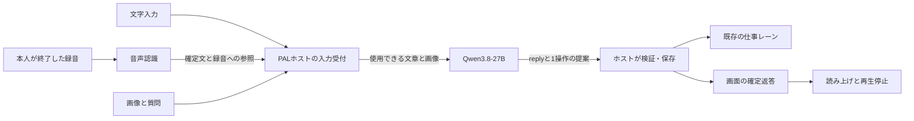

# PALマルチモーダル設計 v1 — Qwen3.8-27B基準

2026-10-08 JST。状態：引継ぎ候補v1。Opus初回指摘を反映済み、SWE-2 Highへの限定送信は承認待ち。製品実装・実機評価は未実施。

## 1. 今回固定する方針

本人の最新指示に従い、会話の解釈・推論・画像理解の基準モデルを **`Qwen/Qwen3.8-27B`** に固定する。「3.8」はモデル世代、「27B」は規模であり、3.8Bと27Bの二つを比較する計画ではない。別の推論モデルやOmni方式の探索は今回行わない。以前の調査資料の「推論モデル未選定」は、この指示で置き換わる。

音声は **録音→音声認識→Qwen3.8-27Bを使うPAL→確定返答の読み上げ** とする。音声部品は接続契約を固定し、最初の検証候補だけを `Qwen/Qwen3-ASR-0.6B` と `Qwen/Qwen3-TTS-12Hz-0.6B-CustomVoice` に絞る。後者は既成の日本語音色 `Ono_Anna` を試験用の初期値とする。これは本人の声の複製でも、好みの最終決定でもない。音声部品の候補は設計側の提案であり、本人が型番まで指定した要件ではない。

実行エンジン、量子化、配置先端末は実機の導入時に確定する。同じ27Bの配信方式・量子化を調整してから、不適合の根拠が出た箇所だけを再検討する。実機がない現在でも、以下の契約と検証条件は確定できる。未測定を理由に設計を保留しない。

| 区分 | v1の対象 |
|---|---|
| 画像理解 | 本人が選んだ静止画1枚と質問。後続質問で同じ原本を再参照できる |
| 音声入力 | 本人が録音開始・終了を操作する日本語の短い発話。録音終了後に1回文字起こし |
| 音声出力 | PALが保存した返答本文の読み上げと停止。画面の返答を常に残す |
| 継続するPAL機能 | 会話、既存のローカル下書き、訂正、対象を指定した中止、参照停止、再送・再起動対策 |
| 後の候補 | 動画、連続会話、音声途中の認識、常時録音、複数画像比較、ベクトル検索、音声専用の会話担当 |

動画は型・時刻の拡張余地を残すだけで、v1の受付形式・完成条件へ入れない。現行Stable-1の優先順位・完了条件・承認境界は変更しない。現在の表示経路の問題は開発側で扱い、この設計で回避しない。

## 2. 現行実装との接点

確認対象：`/private/tmp/personal-agent-lab-stable0-20261006`、HEAD `5e7c76c24dd8bf700d2811c7188739cdc77d9aa8`。開始時の作業ツリーはclean。旧ワークスペースの実装は使用していない。

| 現在の場所 | 現在の役割 | 将来の変更点 |
|---|---|---|
| `pal/server.py` | `/api/message`は64KiB以内のJSON、text必須。loopback・Host/Origin制限あり | メディア用の有限サイズ受付を追加。既存のテキストAPIを維持 |
| `pal/runtime.py` | 通常入力を保存し、Primaryと仕事の別レーンで処理 | 音声の前処理をPrimaryの前に追加。推論に画像を渡す |
| `pal/primary.py` | 閉じたJSONでreplyと1操作を提案 | 操作の種類・権限を増やさず、画像付き文脈を渡す |
| `pal/store.py` | sourceの参照可否、入力キー、revision/epoch、効果と返答の原子的保存 | メディア入力も同じ境界へ接続。原本と派生情報の対応を保持 |
| `pal/native.py`等のprovider | 現在は`complete(prompt: str)` | Qwen用の画像付き要求を別契約で追加。既存text接続へ画像を黙って落とさない |
| `pal/web/app.js` | 入力・確定結果・操作・状態表示 | 添付、録音、認識文、読み上げ、停止を追加 |

現行の公式Claude接続での合格を、Qwenの合格へ読み替えない。Qwenの選定は新しい接続・モデル導入・外部送信・追加費用を自動的に許可するものではない。

## 3. 全体の受け渡し

Qwenが画像を読むために、別の画像解釈エージェントを挟まない。ホストが画像を読める形へ変換して渡し、Primaryも必要なExpertも同じ基準モデルを使う。モデルを複数プロセスで常駐させることは要求しない。

PAL本体は標準ライブラリを使う管理部分を維持する。画像デコードとモデル推論の依存は、導入時に明示するローカルのメディア処理・推論プロセスへ隔離する。新しい汎用エージェント、任意のshell実行、任意ファイル読取は作らない。処理プロセスは許可されたバイト列と固定設定を受け取り、結果を返すだけとする。

## 4. 入力、原本、派生情報

追加する論理情報は、メディアのバイト列、入力の進行状態、変換の記録に限定する。最初の保存案はSQLiteの有限サイズBLOBとメタデータである。既存のartifactと同様にDB内へ保存し、DBと別ファイルの二重コミットを避ける。大規模ストレージ、独自DAG、外部DBは導入しない。実装時のテーブル名・migration番号は開発側が最新schemaに合わせる。

| 情報 | 必須内容 |
|---|---|
| MediaAsset | ホスト発行asset_id、種類、実MIME、SHA-256、バイト数、寸法または時間、BLOB、元asset_id（派生時） |
| MediaInput | 共通のclient_key、入力内容のhash、画像質問/本人録音の区別、asset_id、状態、最終的なinput_record_id |
| MediaDerivation | 用途、元asset_id（画像/ASR）またはresponse_id（TTS）、結果hash、生成部品と版、正規化・領域・text区間、依存するsource ID。TTS音声本体は永続BLOBに含めない |

識別子・hash・時刻・対応付けはホストが決める。モデルの値を正本として採用しない。同じバイト列が別の会話へ渡されても、受付の権限や参照停止を共有しない。hash一致は本人の新たな指示の代わりにならない。

**受理後のAI参照単位は既存Recordのsource IDに合わせる。** 画像は質問文のRecordへ、音声は採用した認識文のRecordへ結び付ける。原本をAIから参照停止する操作は、その入力Recordと依存する派生物を対象にする。画像だけを忘れて質問文だけをAIへ残す、といった部分忘却はv1へ入れない。

本人が音声入力として明示した録音の最終認識文は、`voice_transcript`由来のuser Recordとして保存する。Recordに入力種別を追加し、primary_contextにも種別と`asr_final_not_human_verified`を渡す。これは聞き取った文であり、本人が手入力した逐語記録だとは表示しない。モデルが書き直した要約を本人の言葉として保存しない。文字の結果hashはsanitize後の保存文を対象とし、変更があればフラグを残す。v1は話者認証を行わず、本人が送った録音全体を認識するため、周囲の人の声を本人から確実に分離できるとは主張しない。画像内の命令は本人の新しい操作指示へ昇格させない。

「覚えて」は既存のsource付き記憶を使う。画像なら原本への参照と本人の質問・説明を保持し、モデルが見出した特徴を本人の永続的な事実として自動登録しない。後の質問では原本を再読する。v1は写真全体を自動索引化しない。

## 5. 入力受付と再送・障害

### HTTPの形式

既存の64KiB上限の`POST /api/message`を維持し、`POST /api/media-input`を追加する。後者は`application/json`、Content-Length必須、Transfer-Encoding拒否、本文16MiB以内。同時受信2件までとし、枠を取れなければ本文を読む前に503。永続化済みで未終了のMediaInputは8件までとする。これらは最初の保護設定である。

JSONは閉じた三形式とする。`image`は`key,kind,text,media`、`voice`は`key,kind,media,image_source_id`、`image_ref`は`key,kind,text,image_source_id,region`。voiceのimage_source_idとimage_refのregionはnullを許す。mediaは`mime,data_base64`だけである。キー重複・未知フィールドを拒否する。base64は厳密に復号し、復号後にも種類別のバイト上限を適用する。image_refはバイト列を受け取らない。

既存のJSON処理を使える有限サイズの方式を選び、独自バイナリフレームやmultipart parserを追加しない。JSON/base64のメモリ増分は実測する。質問文・原本bytesのhash・明示した画像source・regionを入力hashへ含め、クライアント申告hashは信頼しない。`GET /api/operation/{key}`を拡張し、文字起こし中と終了状態を返す。メディアの取消し・読み上げ開始/停止はHost/Origin検査を持つPOSTの構造化操作にし、GETは生成や状態変更を起こさない。

### 画像

1. 本人がJPEG/PNGの静止画1枚と質問文を送る。ホストは有限長と復号後サイズを検査し、原本と`received`のMediaInputを同じトランザクションで予約・保存する。重複ならその保存済み状態を返す。
2. 予約後に、ロック・DBトランザクションの外でデコードとview作成を行う。実形式・ピクセル上限等の検査成功後、表示用画像、user Record、MediaInputの`admitted`、Primary受付を一つのトランザクションで結び付ける。取消し済みの状態なら適用しない。最初のACKは入力の保存を意味し、画像理解や作業開始の成功を意味しない。
3. Qwenへ送る直前にsourceを再確認する。全景を渡し、本人が選んだ切出しがある場合だけ同じ原本の領域画像も渡す。
4. Qwenの提案を既存のhost境界で検証し、効果と返答を一緒に保存する。Expertが原画像を必要とするときも、WorkOrderの許可済みsourceからだけ画像を解決する。

原本は保持する。モデルへはEXIFの向きを反映し、不要なメタデータを含めずに再エンコードした表示用画像を渡す。変換後画像のhashと、向き補正後の原画像上の領域・寸法を記録する。原本自体は書き換えない。小さい文字が読めなければ、読めない範囲を示し、拡大や切出しを使う。別のOCRモデルの常設はv1の必須にしない。

過去画像は本人が会話欄の画像カードから「この画像を使う」を選び、入力欄の選択画像として表示する。選択は解除可能で、次の文字/音声入力へimage_source_idとして明示して渡す。元のRecordがusableの場合だけ許可し、新しい入力のmanifestに元Recordを含める。クロップは向き補正後の原本座標上の整数`x,y,width,height`で、正の面積と境界内であることをホストが検査する。複数画像を勝手に最新順で選ばない。

recent contextやnoteに画像Recordがあっても、未選択の画像bytesは自動で送らない。primary_contextのsource metadataに`has_image:true, image_availability:not_provided|provided|reference_stopped|unsupported`を付ける。画像が今回未提供であることをモデルに知らせ、見たように答えさせない。参照停止済みsourceの内容・ラベルは既存方針に従い除外する。MM-I03/I05は、この明示選択を使った再読を評価する。

### 音声

1. 録音中は端末上の入力草稿。本人が録音を終了・送信して初めてメディア入力を受理する。v1は録音終了後の認識だけを扱う。
2. バイト列・hash・入力キー・`received`を保存し、CASで`transcribing`をclaimする。まだuser RecordやGoalを作らない。画面には「文字起こし中」と入力操作IDを出す。
3. ASRは確定文と使用したモデル情報を返す。ホストが同じ入力・処理中状態・元バイト列の一致、上限とsanitizationを検証する。無音/空文/失敗なら推論やGoalを開始しない。
4. 認識成功時は、認識文のuser Record、原本との対応、Primary受付、MediaInputの`admitted`を一つのDBトランザクションで保存する。既存`prepare_primary`の内側処理を再利用し、外側から別々にcommitしない。
5. 以後は現在のPrimaryと同じ処理。Expert質問への回答に使う場合も、元となる採用済み認識文を渡す。モデルが回答を書き直す経路を作らない。

聞き取った文と、受け付けた重要条件を画面で確認・訂正できる。通常の会話すべてに確認ボタンを挟まない。認識終了後の訂正は新しい入力として既存の訂正・対象特定を使い、古いRecordを上書きしない。

### 入力の状態とキー

画像は`received → normalizing → admitted`、音声は`received → transcribing → admitted`。各claimと成功/取消しは期待する直前状態のCASで一度だけ行う。途中から`failed / cancelled / interrupted`へ終了できる。image_refで新たな切出しが必要な場合もnormalizingを通り、変換はDBの外で行う。既存viewを使う場合は変換を省ける。元sourceの再検査とuser Record/Primary受付は同一トランザクションで行う。部分的な文字起こしで`admitted`へ進めない。

client_keyは既存の操作と同じ予約境界で扱う。`Store._dedupe`を変更し、MediaInputのキーも終了状態を含めて検査する。別のtext/制御操作による横取りを拒否する。同じキー・同じ要求は保存済みの進行/終了状態を返し、failed/cancelled/interruptedでも再実行しない。同じキー・別内容はconflict。

内部Primaryにも**同じclient_key**を使い、別の公開派生キーを作らない。operation_idはこの共通client_keyを指す。非公開の`admit_media`トランザクションだけが、自分のMediaInputの予約を引き継いでPrimary行を作れる。input hash・処理中状態・sourceを照合し、Record・Primary行・MediaInputの対応を原子的に保存する。通常の`prepare_primary`は同じmedia予約キーを使用できない。結果のoperation参照はMediaInputから対応するPrimary outcomeへ一意に解決する。

admissionのcommitとPrimary Futureの公開は既存の`_reply_lock`と同じ短い境界で行い、同時の完了通知・再送から二つの推論を開始しない。推論はそのlockの外で行う。既存内部効果キーの整理を、この変更に混ぜて一般化しない。

通常入力として受理される前の「この録音を取り消す」はMediaInputを終端のcancelledへCASし、ASRの遅い返答は適用しない。同じキーを再利用しないため、入力の世代カウンターは不要とする。すでにadmittedなら取消しを成功扱いにせず、確定済み入力と対象作業の操作を表示する。録音の取消しと作成済みGoalの中止を混同しない。

再起動時、未受理の認識処理は`interrupted`へ確定し、自動再認識しない。本人が再送する場合は新しいキーで行う。admitted済みは既存の保存された受付・outcomeを再表示し、ASRもPrimaryも再実行しない。事前受付の取り消し・失敗・再起動によって既存Goalを変更しない。

## 6. Qwenへ渡す契約

内部要求は `pal-mm-v1` とし、`request_id`、`purpose(primary|expert)`、基準model_id、既存のinstructions/context、許可済みtext/image parts、有限budgetを持つ。各image partはsource_id、asset_id、表示用viewのhashと変換情報を参照する。要求・結果の形は[CONTRACT-EXAMPLES.json](CONTRACT-EXAMPLES.json)に示す。全応答JSONの64KiB上限と、reply本文の8192 UTF-8 bytes上限は別々に検査する。送信先や生のファイルパスをモデルから選ばせない。

asset_id/view_idはホスト内部の対応付けに使う。モデルへsourceとして提示する識別子は既存のRecord IDだけである。既存Primary指示とINPUT_JSONをtext partへ、実画像をimage partへ分ける。返答は実行エンジンが提供するfinal contentだけを閉じたdecoderへ渡す。推論過程は保存・ログ・TTSへ流さない。finalとreasoningを確実に分離できない接続は未対応とし、任意文字列の削除で出力を修復しない。

ホストが検証済みバイト列を実行エンジンの画像形式へ変換する。エンジン固有のbase64等はアダプター内部に閉じ込め、会話ログへ埋め込まない。文字だけの要求も同じQwen基準で評価するが、既存のtext provider契約は壊さない。画像非対応の接続へは`unsupported_modality`を返し、タグ・ファイル名だけの回答を画像理解成功としない。

Primaryの返答は既存`primary-json-v1`のreplyと1操作だけを維持する。添付が増えても、任意toolや任意source IDを許可しない。文脈はホストの予算内だけを渡す。最新入力・操作に必要なsourceを優先し、画像が上限を超える場合は省略を隠さず対象を確認する。現在のrecent30/first20の文章文脈を無制限検索へ広げない。

sourceによらない固定のerror codeをhost outcomeへ渡し、unsupported_modality、provider_timeout、入力形式エラー、staleを区別して表示する。現在のgenericなPrimary失敗へ全てをまとめない。例外本文やraw返答は画面・ログへ出さない。

接続記録にはモデルrevision、量子化、engine/adapter版、processor設定、対応形式、実測の有無を保存する。`claimed`と`verified`を区別し、モデル名が合うだけで画像受付をverifiedにしない。

実モデルの同一性はホスト側の配置記録・重み/設定の版・実行ログから確認する。モデル自身の名乗りや返答のmodel_idだけを証拠にしない。

## 7. 読み上げと再生

TTSにはホストが保存したassistant Recordの返答本文だけを渡す。Primaryの未確定JSON、思考過程、モデルの未承認の完了宣言は読まない。下書き全体を勝手に読むことはせず、確定返答・完了通知を対象とする。本文が長い場合は300文字以内の最後の句点・感嘆符・疑問符・改行で切り、なければ300文字位置で切る。改変・要約せず、各区間のUnicode codepoint位置と元返答のhashを保存する。生成音声が60秒の上限を超えた場合はその区間を失敗にし、切り捨てて読み上げ完了としない。

音声入力モードでは確定した返答の読み上げを既定とし、文字入力時は読み上げボタンから開始する。ユーザーが読み上げをOFFにできる。1セッションで一つだけ再生する。

生成の状態（requested/synthesizing/ready/failed/interrupted）と端末の再生状態（playing/stopped/ended/unknown）は分ける。端末状態は診断イベントでありGoalの正本ではない。端末のended通知は再生イベントの証拠であり、本人が聞いた証拠でもGoal完了の証拠でもない。接続が切れた場合は再生済み範囲をunknownとし、勝手に続きや先頭を再生しない。

再生要求はresponse_id、音色設定hash、playback_id、boot_id＋session epochに結び付ける。host起動ごとにboot_idを変える。**TTS生成・各区間の引渡しの直前に`_usable([response_id])`で依存manifest全体を再帰的に確認する。** コピーしたsource一覧は権限判定に使わない。

停止・新しい録音開始で端末は直ちに再生を止め、ホストもepochを進める。端末が停止を認識した後の古いTTS結果や遅れたチャンクは再生しない。参照停止後はhostが次の区間を渡さず、端末は通知や次の状態取得で停止を検知しキューを破棄する。既に端末へ送った音を遡って取り消したり、切断中の端末へ瞬時の停止を保証したりしない。再接続・再起動後の自動再生はなく、本人の再生操作が必要。

「話を止める」は読み上げ停止、「その下書きを止める」は既存Goal中止である。v1では再生停止ボタン・録音開始による割込みを保証対象とし、常時マイクによる自動barge-inは後の機能とする。ASR/TTS障害は文字で表示し、確定済みの会話や仕事を失敗へ変更しない。

## 8. 初期上限と並行処理

以下は実装の最初の保護上限であり、Qwenの限界や実測SLAではない。変更は設定版と根拠を残す。現在の本番設定へ適用しない。

| 対象 | v1の初期値 |
|---|---|
| 画像 | JPEG/PNG、1原本/入力、10MiB、デコード後20メガピクセル以内 |
| Qwenへ渡す画像 | 全景1枚＋本人が選んだ領域1枚まで。長辺2048px以内。変換内容を記録 |
| 本人の録音 | 60秒以内。PALとの受け渡しはWAV PCM16・mono・16kHz、2MiB以内。原本としてこの送信バイト列を保持 |
| 録音の認識結果 | 既存文字入力の12000文字以内かつ既存JSON受付上限に収まること |
| 読み上げ単位 | Unicode文字列の連続区間、1区間300文字以内。自動要約なし。返答上限8192 UTF-8 bytesを維持 |
| 音声生成結果 | 1区間60秒以内、WAV PCM16 mono、sample_rateと実バイト数を検査。上限12MiB |
| 前処理と音声1呼出し | 有限の60秒。失敗を返し、自動再試行・別サービスfallbackなし |
| Qwen1呼出し | 有限の180秒を初期候補。利用可能な既存許可・残予算が短ければそちらを優先 |

画像数は現在の入力と選ばれた過去画像を合わせた予算。複数原本が同時に必要な依頼はv1未対応として説明する。録音の形式変換は端末の録音処理側で行い、無音や時間をclient申告だけで判定しない。未対応の録音形式をファイル名変更で通さない。

ASR/TTSの重い処理はDBトランザクションと共通受付ロックの外で実行する。入力・即時の構造化操作は継続して受け付ける。単一QwenプロセスでもPrimaryとExpertの待ち行列を区別し、Primary待ちを優先する。実行中のExpert推論を安全に横取りできる保証はしない。最悪待ち時間と2要求同時処理を後日評価し、満たせない実行構成を「作業中も快適に会話できる」と認定しない。

ASR・TTS・画像正規化は、それぞれ上限1の別の処理枠とし、現在のPrimary用ThreadPoolの2枠を占有しない。入出力全体の受付上限で待ち行列を制限する。取消し・timeout時は監督プロセスが可能な終了操作を行い、終了を確認できない処理枠は再利用しない。古い結果の拒否と、実際にモデル計算が止まったことは別の証拠とする。

## 9. 参照停止・秘密情報・保存

参照停止は原本から派生した認識文・説明・要約・返答・読み上げ・索引へ伝播する。sourceを読む直前と結果をcommitする直前の両方で確認する。稼働中のPrimary/Expertは現在のrevision/epochとsourceゲートを維持し、ASRは処理中状態のCAS、TTSは再生世代を使う。

依存する返答を再表示・再生する経路も同じAI参照判定を通す。監査履歴・原本を本人が確認する経路は保持し、「忘れて」を物理削除だと表示しない。処理先へ既に渡した情報を取り戻したと主張しない。source停止で端末内の再生キューも無効化する。

未受理のMediaInputはAI文脈から解決できず、本人の監査画面から入力状態と原本を確認できる。cancelled/failed/interruptedの原本もこの経路に限定する。メディアBLOBは合計1GiBを初期の論理容量上限とし、同時受付でもトランザクション内で予約量を含めて検査する。原本＋生成予定viewの上限分を予約し、成功時は実量へ置き換える。quota超過なら`media_quota_exceeded`で拒否し、古い原本を自動削除しない。SQLite/WAL等の実ディスク量は別に確認する。容量不足の失敗で保存済みとACKしない。

TTS音声本体は最大2区間・合計24MiBの揮発キャッシュだけに置き、原本保管quotaへ永続追加しない。終了・停止・source停止・再起動で破棄する。hash、text区間、生成部品、診断イベントだけを残す。再生のための再生成は本人の明示再生とsource検査に基づき、以前と同じ音声bytesになるとは保証しない。

画像・音声は従来の文字sanitizeだけでは秘密情報除去できない。生メディアとそのbase64をプロンプトログ・通常ログ・git・エラー本文へ残さない。原本BLOBは本人が明示して送った入力の保管領域に限定する。既定は許可されたローカル処理で、外部サービスへ送らない。EXIF等はmodel用viewへ含めないが、写り込んだ情報の除去を保証するものではない。試験は非秘密の合成素材で行い、既存のtext canary合格をメディア保護へ流用しない。

本人録音と画像添付は、操作画面で明示された入力だけを受け付ける。マイクの自動開始、背景の常時取得、画像ライブラリ探索は行わない。ループバックのHost/Origin・有限長・CSPを維持し、音声再生に必要な同一originのmediaだけを追加する。モデル向けraw blob取得口をブラウザーへ汎用公開しない。

メディアGETは推測困難なID、`Cache-Control:no-store`、`Cross-Origin-Resource-Policy:same-origin`を使い、明示されたcross-siteのFetch Metadataを拒否する。通常再生のsource検査と本人の監査閲覧を別routeにする。同一origin URLで画像・音声を扱い、v1で外部originやblob URLへのCSP拡張をしない。これはWeb上の取得を制限するもので、同じ端末の任意ローカルプログラムに対する本人認証だとは主張しない。

## 10. 評価条件

評価の具体例と期待結果は [ACCEPTANCE.json](ACCEPTANCE.json) にある。すべて未実施として固定する。

| 評価段階 | 合格条件と証拠 |
|---|---|
| 契約と状態 | 再送・取消し・参照停止・crash・遅延結果で二重Goal、誤対象変更、参照停止後の再利用が0。実際のSQLite/HTTP/fault試験で確認 |
| Qwen実モデル | 基準モデルの正確な版・engine・量子化を記録。名前・日付・人数・否定・位置関係を保持し、不明箇所を作らない。各固定ケースの期待値または適切な確認を満たす |
| 音声実機能 | 固定試験では重要条件が正しく届くことを照合し、誤りはFAILとして残す。認識文を受理時に表示し、訂正が正しい対象へ反映される。読み上げは確定文と一致し、端末が停止を認識した後の古い再生が0 |
| 利用感と資源 | 実機の冷起動・通常使用、作業中の会話、応答開始、メモリ、待ち行列、取消しを測定。一連の実利用で本人が使えるかを確認 |

品質は平均認識率だけで合格にしない。例えば「15日を17日に訂正」の最終条件が15日のままなら失敗である。文字起こしの文字誤り率は補助指標とし、固有名詞・日付・数量・否定の意味を別に照合する。読めない画像は正解を推測するより、読めないと示せることを評価する。

この品質条件は、固定した実試験を正解と照合するためのものである。通常利用で認識誤りを常に検知し、本人が見る前の下書き作成を必ず防止できるとは保証しない。見逃された誤認識は測定・改善対象として残し、全発話確認の新しいgateを作らない。MM-S系のfixture/fault試験はhost構造の証拠であり、MM-I/A/Tの実機能の代わりにならない。

速度は録音終了→受付→ASR終了→Qwen待機/実行→返答commit→TTS→端末再生開始を個別に測る。画像は送信→view準備→Qwen→commit。短い固定3入力について冷起動各1回、通常状態各3回を初期の有限測定案とし、中央値・最大値・失敗と入力長を報告する。この小標本から長期安定性やp95保証を主張しない。これは本人に課す利用回数条件ではない。

具体的な「何秒以内なら実用合格か」は端末・構成がない現時点では未採用。上記の処理打切り時間は実用速度の合格値ではない。実機導入時に候補構成と測定条件を記録し、同じ条件で評価する。速度未測定は設計引渡しを妨げないが、製品完成のPASSにもできない。

## 11. 開発へ渡す単位

1. 本設計・本人指示・レビューと採否を、既存の案件判断正本から参照できる場所へ登録する。現行Stable-1の追加gateにしない。
2. source付きメディア受付、原本保管、状態・dedupe・参照停止の最小単位を、無害なfixtureで実装する。
3. Qwenのtext/imageアダプターを接続し、閉じたPrimary/Expert提案の検証を維持する。
4. ASR受付とTTS出力を追加し、訂正・取消し・再送・再起動・古い音声の拒否を確認する。
5. 実機が利用可能になった段階で、同じ契約をQwenと音声部品で評価する。実モデルの不足をmock合格で埋めない。

開発側へは「将来機能の設計と実装準備」として渡す。実装着手の時期は現行の案件判断・進行中の作業に合わせる。新しい依存導入、接続、費用、外部公開を設計資料から推測して有効化しない。

## 根拠

- [Qwen3.8-27Bモデルカード](https://huggingface.co/Qwen/Qwen3.8-27B)：画像・動画入力の能力と入力例。PAL上の証明ではない。
- [Qwen3-ASR](https://github.com/QwenLM/Qwen3-ASR)：0.6Bと日本語の認識を確認。
- [Qwen3-TTS](https://github.com/QwenLM/Qwen3-TTS)：0.6B-CustomVoiceと既成日本語音色を確認。
- [前回の公開実装調査](../REPORT.md)：Qwen-Live-Harness、Open WebUI、Qwen-MM-Plugins、LiveKit、Immich等の固定版・確認箇所を保存。
- PALの現行`AGENTS.md`・`STATE.md`・`SPEC.md`・`DESIGN.md`・`ACCEPTANCE.md`・`DECISIONS.md`、および上記ソース。最新の本人指示がモデル未選定の旧候補を置き換える。
