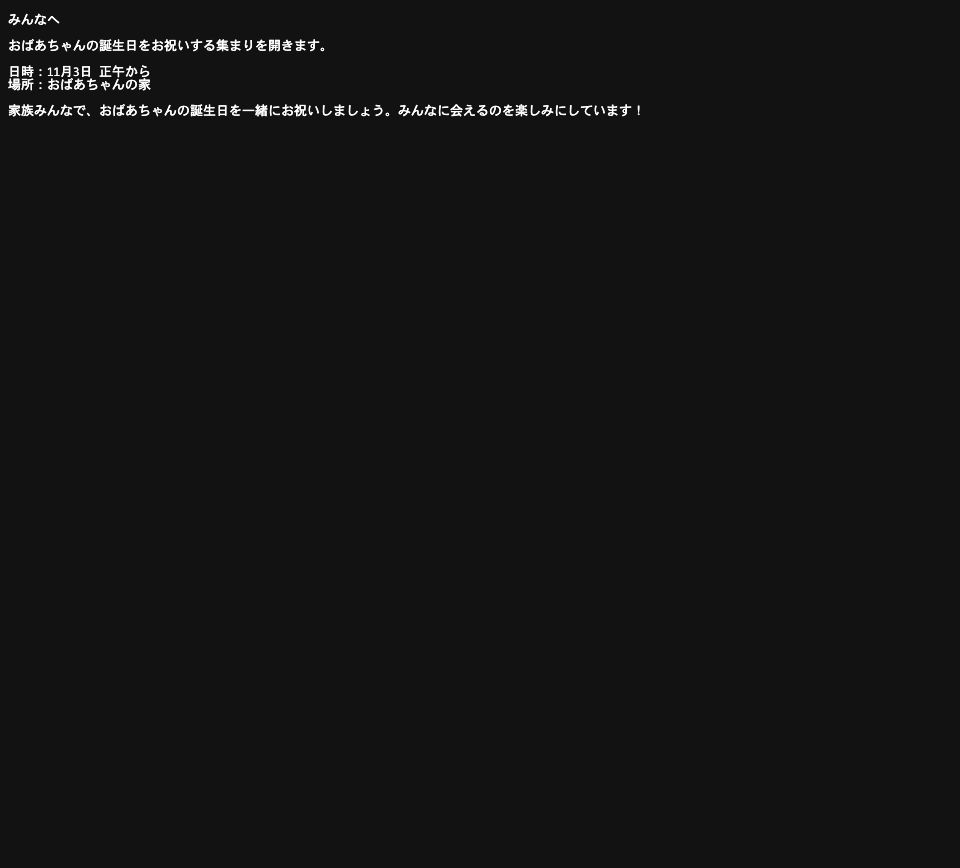

# HR-STABLE1-001：会話から下書きまでの使い勝手

対象は候補版 `a1ba755`、製品コード `1a14de9` です。以下は実際の画面から
公式Claude接続を使って得た結果です。入力は開発側の合成ケースであり、
本人の入力・評価ではありません。Qwen3.8-27Bでの動作確認はまだ行っていません。

## 共有した情報を使って依頼する

背景として、美香さんに勉強会の配布資料の誤字を確認してもらったことと、
丁寧すぎない二文のお礼にしたいことを伝えました。この段階では作業は作られません。
「では、美香さんへのお礼をその条件で下書きして。送らずにここに置いてください」
と依頼すると、確認済みの事実を聞き直さず、次の下書きが保存されました。

> 美香さん、今回は本当にありがとう！勉強会の配布資料の誤字を確認してくれたこと、すごく感謝しています。

## 足りない情報を会話で補う

祖母の誕生日の集まりを家族に案内する下書きを頼み、日時と場所はまだ伝えて
いないので確認してほしいと伝えました。PALは次のように応答しました。

> 承知しました。おばあさまの誕生日の集まりの案内を家族向けに下書きしますね。まず、集まりの日付・開始時刻・場所を教えていただけますか？いただいた内容をもとに下書きを作ります。

「11月3日の正午から、祖母の自宅で開きます。その情報で案内を下書きしてください」
と会話で答え、次の下書きが保存されました。

> みんなへ
>
> おばあちゃんの誕生日をお祝いする集まりを開きます。
>
> 日時：11月3日 正午から
> 場所：おばあちゃんの家
>
> 家族みんなで、おばあちゃんの誕生日を一緒にお祝いしましょう。みんなに会えるのを楽しみにしています！

外部への送信は行っていません。両方とも実際の成果物とホストの保存証拠が一致し、
全213テストも通っています。画面の受付メッセージには現在、詳しい作業条件が表示されます。
観測した結果と制約の詳細は [検証記録](README.md) にあります。

## 評価いただきたいこと

この一連の「共有済みの情報を使い、必要な情報だけ尋ね、下書きを返す」流れは、
普段の依頼を任せるうえで役に立ちそうでしょうか。期待と違う点があれば、その点を教えてください。
細かな文言・内部設計・モデル選定の承認は不要です。

本人にしか判断できない実際の使い勝手を確認するための一項目です。回答を現在の
N1-07/N1-09/N1-10に反映し、問題があれば修正、満たせば最終リリース監査に進みます。
未回答は未回答のまま記録します。旧72時間・入力数・セッション数の条件はありません。
